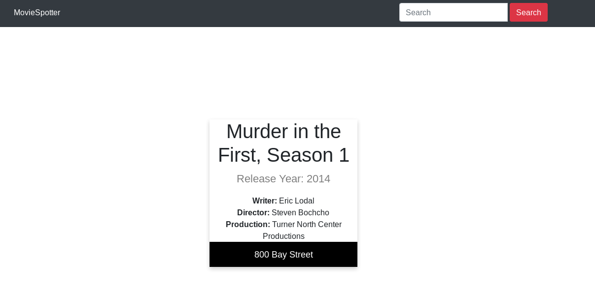

# Movie Spotter

[](https://github.com/nightwarriorftw/MovieSpot/issues) [](https://github.com/nightwarriorftw/MovieSpot/network/members) [](https://github.com/nightwarriorftw/MovieSpot/stargazers)    [](https://twitter.com/intent/follow?screen_name=nightwarriorftw) [](https://telegram.me/nightwarriorftw)

## :ledger: Index

- [About](#beginner-about)
- [Usage](#zap-usage)
- [Developmen Environment](#nut_and_bolt-development-environment)
- [File Structure](#file_folder-file-structure)
- [Gallery](#camera-gallery)
- [Credit/Acknowledgment](#star2-creditacknowledgment)
- [License](#lock-license)

## :beginner: About

Many people are often interested in visiting famous spots where movies were shot. [This](https://favmoviespot.herokuapp.com/) web application helps them find out shooting locations of their favorite 
movies.

## :zap: Usage
Just simply visit [Your Movie Spot location](https://favmoviespot.herokuapp.com/) and search your favourite movie location.

### :nut_and_bolt: Development Environment

#### 1. Clone the Repository

```Bash
git clone https://github.com/nightwarriorftw/MovieSpot.git
cd MovieSpot
```

#### 2. Install the virtual environment and activate it
```Bash
python3 -m venv virtual
source ./virtual/bin/activate
```

#### 3. Install the dependencies
```BASH
pip install -r requirements.txt
```

#### 4. Make migrations and run tests:

```BASH
python manage.py makemigrations
python manage.py migrate
python manage.py test
```

#### 5. Run the project:

```BASH
python manage.py runserver
```

### :file_folder: File Structure
```
├── core
│   ├── admin.py
│   ├── apps.py
│   ├── __init__.py
│   ├── models.py
│   ├── templates
│   │   ├── home.html
│   │   ├── movie_details.html
│   │   ├── movie.html
│   │   ├── movie-results.html
│   │   ├── search
│   │   │   ├── card.html
│   │   │   ├── cardSnippet.html
│   │   │   └── searchSnippets.html
│   │   └── search.html
│   ├── tests.py
│   ├── urls.py
│   └── views.py
├── data.csv
├── db.sqlite3
├── dockerfile
├── LICENSE
├── manage.py
├── moviespot
│   ├── asgi.py
│   ├── __init__.py
│   ├── local_settings.py
│   ├── settings.py
│   ├── urls.py
│   └── wsgi.py
├── README.md
├── requirements.txt
```

## :camera: Gallery




## :star2: Ack
**Tech Stack used**

- Django, HTML5, CSS3, Javascript (Intermediate)
- Docker (Very familiar)
- Database Postgress(Production), Sqlite3(Staging)

## :lock: License

[LICENSE](/LICENSE)

*Haven't uploaded the database. Please make an issue on the repo in case you want to upload*
